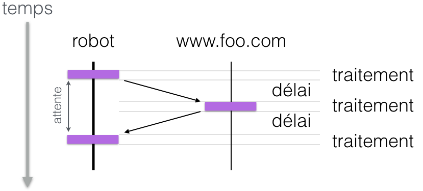
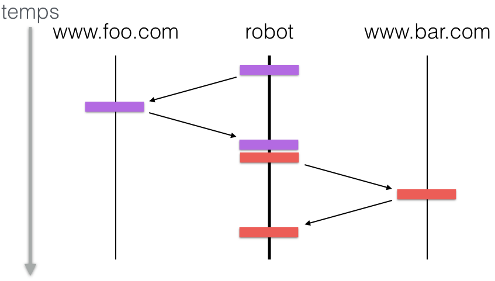
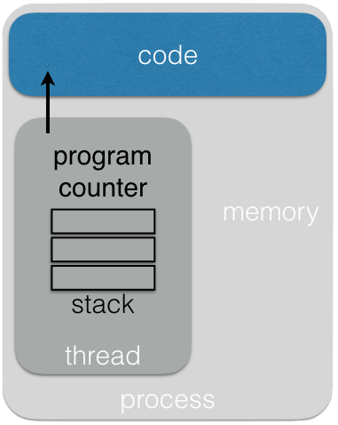
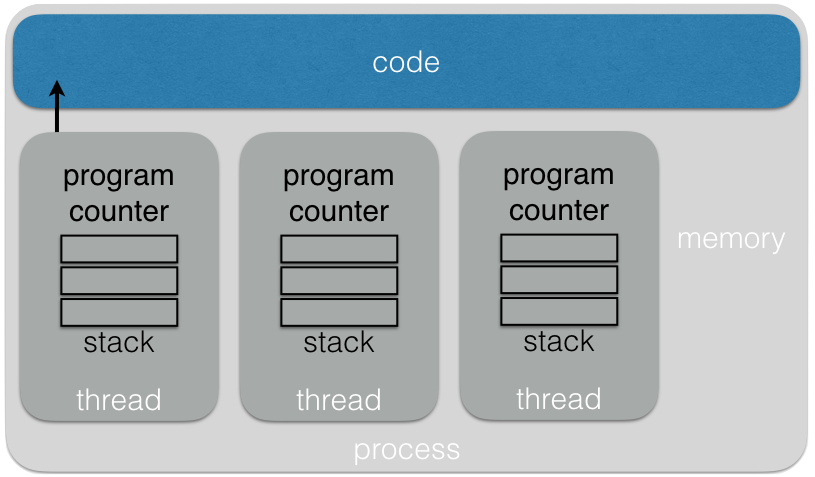
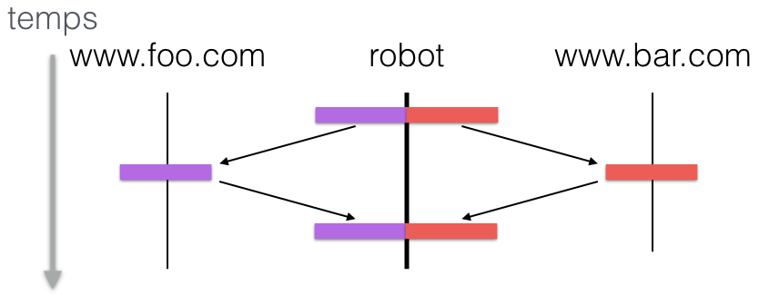
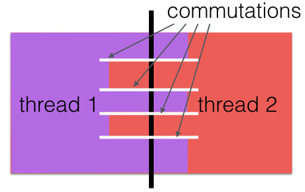
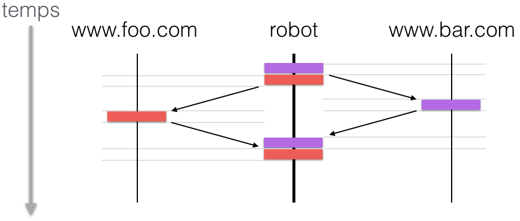

---
jupytext:
  text_representation:
    extension: .md
    format_name: myst
    format_version: 0.13
    jupytext_version: 1.11.1
kernelspec:
  display_name: Python 3
  language: python
  name: python3
---

<div class="licence">
<span>Licence CC BY-NC-ND</span>
<span>Thierry Parmentelat &amp; Arnaud Legout</span>
<span>Inria - UCA</span>
</div>

+++ {"slideshow": {"slide_type": "slide"}}

# programmation asynchrone

+++ {"slideshow": {"slide_type": "slide"}}

# typologie d'applications

* CPU-intensive
* IO-intensive

+++ {"slideshow": {"slide_type": "slide"}}

# requête à un serveur

+++ {"slideshow": {}}

 

+++ {"slideshow": {"slide_type": "slide"}}

# deux requêtes en séquence

+++ {"slideshow": {}}

 

+++ {"slideshow": {"slide_type": "slide"}}

# processus simple



+++ {"slideshow": {"slide_type": "slide"}}

# avantages / inconvénients

+++ {"cell_style": "split"}

* parallèlisme
* isolation

+++ {"cell_style": "split"}

* *trop* d'isolation
* échelle : 10x - 100x

+++ {"slideshow": {"slide_type": "slide"}}

# threads



+++ {"slideshow": {"slide_type": "slide"}}

# avantages / inconvénients

+++ {"cell_style": "split"}

* disponible en python 

  [`import threading`](https://docs.python.org/3/library/threading.html#module-threading)

+++ {"cell_style": "split", "slideshow": {"slide_type": "-"}}

* utilisation **très** délicate
* échelle 1000x 

+++ {"slideshow": {"slide_type": "slide"}}

# commutations de contexte (1)

+++

### deux pages téléchargées par 2 threads différents

+++ {"slideshow": {}}

 

+++ {"slideshow": {"slide_type": "slide"}}

# commutations de contexte (2)

+++ {"slideshow": {}}

 

+++ {"slideshow": {"slide_type": "slide"}}

# callbacks

+++ {"cell_style": "center", "slideshow": {"slide_type": "fragment"}}

* associer à un événement
* une fonction à exécuter

+++ {"cell_style": "center", "slideshow": {"slide_type": "fragment"}}

* induit un découpage du code en petits morceaux
* logique difficile à suivre

+++ {"slideshow": {"slide_type": "slide"}}

# `asyncio` 

+++

* notion de **coroutines**
* qui s'exécutent en parallèle
* mais dans **un seul thread**
* avec du code **lisible**
* en donnant du contrôle sur les changements de contexte
* et sans besoin de saucissonner son code en callbacks
* échelle 10 000x - 100 000x

+++ {"slideshow": {"slide_type": "slide"}}

# callback *vs* coroutine

+++ {"cell_style": "split"}

```
function pong_handler(client) {
    client.on('data', function (data) {
        client.on('data_written', function () {
            client.close()
        });
        client.write(data)
        client.flush()
    });
}
```

+++ {"cell_style": "split", "slideshow": {"slide_type": "fragment"}}

le serveur du protocole 'ping-pong'
```
async function pong_handler()
{
    client.write(await client.read())
    await client.flush()
    client.close()
}
```

+++ {"cell_style": "center"}

<span style="font-size:smaller;">
exemple tiré de https://mdk.fr/blog/python-coroutines-with-async-and-await.html
</span>

+++ {"slideshow": {"slide_type": "slide"}}


