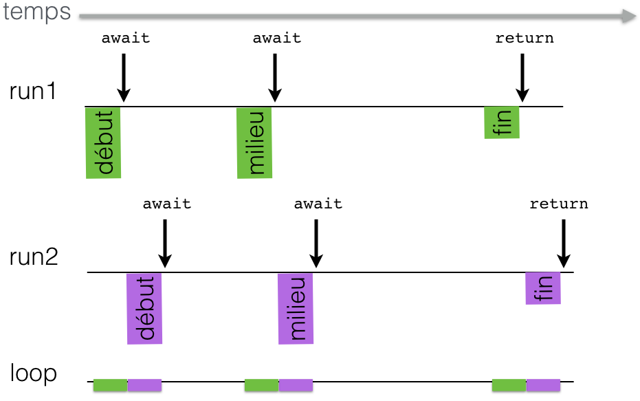
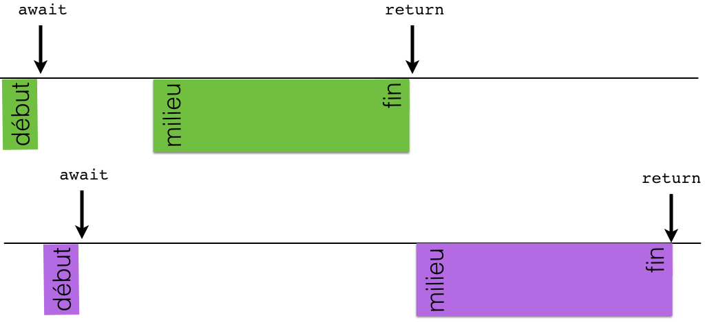

---
jupytext:
  text_representation:
    extension: .md
    format_name: myst
    format_version: 0.13
    jupytext_version: 1.11.1
kernelspec:
  display_name: Python 3
  language: python
  name: python3
---

<span style="float:left;">Licence CC BY-NC-ND</span><span style="float:right;">Thierry Parmentelat &amp; Arnaud Legout&nbsp;</span><br/>

+++ {"slideshow": {"slide_type": "slide"}}

# premiers exemples

+++

### les concepts de base en action

```{code-cell} ipython3
import asyncio
```

+++ {"slideshow": {"slide_type": "slide"}}

## coroutine

```{code-cell} ipython3
---
slideshow:
  slide_type: fragment
---
async def morceaux(message):

    # on appelle le code synchrone normalement
    print(message, "début")
    # avec await on rend la main
    await asyncio.sleep(0.5)

    print(message, "milieu")
    await asyncio.sleep(1)
    
    print(message, "fin")
    return f'{message} par morceaux'
```

+++ {"cell_style": "center", "slideshow": {"slide_type": "slide"}}

# coroutines

+++ {"cell_style": "split"}

fonction coroutine

```{code-cell} ipython3
---
cell_style: split
slideshow:
  slide_type: '-'
---
# la fonction coroutine
morceaux
```

+++ {"cell_style": "split", "slideshow": {"slide_type": "fragment"}}

objet coroutine

```{code-cell} ipython3
:cell_style: split
:slideshow: {}

# retourne un objet coroutine
morceaux("run")
```

+++ {"slideshow": {"slide_type": "slide"}}

# boucle d'événements

```{code-cell} ipython3
---
slideshow:
  slide_type: fragment
---
loop = asyncio.get_event_loop()
```

```{code-cell} ipython3
---
slideshow:
  slide_type: fragment
---
loop.run_until_complete(morceaux("run"))
```

+++ {"slideshow": {"slide_type": "slide"}}

# plusieurs traitements

```{code-cell} ipython3
---
slideshow:
  slide_type: fragment
---
loop.run_until_complete(
    asyncio.gather(morceaux("run1"),
                   morceaux("run2")))
```

+++ {"slideshow": {"slide_type": "slide"}}



+++ {"slideshow": {"slide_type": "slide"}}

# ce qu'il ne faut pas faire

```{code-cell} ipython3
---
slideshow:
  slide_type: fragment
---
import time 

async def famine(message):

    print(message, "début")
    # avec await on rend la main
    await asyncio.sleep(0.5)

    print(message, "milieu")
    # on garde la main au lieu de la rendre
    time.sleep(1)
    print(message, "fin")
    return f'{message} par famine'
```

+++ {"slideshow": {"slide_type": "slide"}}

## famine en action

```{code-cell} ipython3
---
slideshow:
  slide_type: fragment
---
loop.run_until_complete(
    asyncio.gather(famine("run1"),
                   famine("run2")))
```

+++ {"slideshow": {"slide_type": "slide"}}

# chronologie

+++



+++ {"slideshow": {"slide_type": "slide"}}

# conclusion

+++ {"slideshow": {"slide_type": "fragment"}}

* on crée une fonction coroutine avec `async def`

+++ {"slideshow": {"slide_type": "fragment"}}

* une boucle d'événements 
  * pour orchestrer plusieurs coroutines

+++ {"slideshow": {"slide_type": "fragment"}}

* une coroutine peut appeler une autre coroutine avec `await`

+++ {"slideshow": {"slide_type": "fragment"}}

* une coroutine peut appeler une fonction synchrone
  * mais attention à ne pas bloquer trop longtemps
