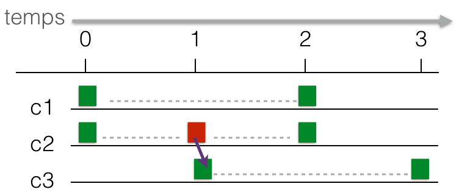

---
jupytext:
  text_representation:
    extension: .md
    format_name: myst
    format_version: 0.13
    jupytext_version: 1.11.1
kernelspec:
  display_name: Python 3
  language: python
  name: python3
---

<div class="licence">
<span>Licence CC BY-NC-ND</span>
<span>Thierry Parmentelat &amp; Arnaud Legout</span>
<span>Inria - UCA</span>
</div>

+++ {"slideshow": {"slide_type": "slide"}}

# coroutines et awaitables

+++

### *my first loop*

+++ {"slideshow": {"slide_type": "slide"}}

# protocole awaitable

+++ {"slideshow": {"slide_type": "fragment"}}

| instruction | classe d'objets   | protocole               | exemple              | 
|------------:|------------------:|------------------------:|---------------------:|
|   `for`     |   itérables       |  `__iter__`             | liste, ensemble      |
|   `with`    | context managers  |`__enter__` & `__exit__` | fichier              |
|   `dict[x]` | hashables         | `__hash__`              | *builtins* immuables |
|   `await`   |   awaitables      | `__await__`             | objet coroutine      |

+++ {"slideshow": {"slide_type": "slide"}}

# `__await__` renvoie un itérateur

```{code-cell} ipython3
---
cell_style: split
slideshow:
  slide_type: '-'
---
class Awaitable():
    def __await__(self):
        print("in awaitable")
        yield "yielded"
```

```{code-cell} ipython3
---
cell_style: split
slideshow:
  slide_type: fragment
---
# il nous faut 
# au moins une coroutine
# pour pouvoir faire await
async def main():
    await Awaitable()
```

```{code-cell} ipython3
---
cell_style: split
slideshow:
  slide_type: fragment
---
# l'objet coroutine
coro = main()
```

```{code-cell} ipython3
---
cell_style: split
slideshow:
  slide_type: fragment
---
coro.send(None)
```

+++ {"slideshow": {"slide_type": "slide"}}

# un peu moins simple 

```{code-cell} ipython3
---
cell_style: split
slideshow:
  slide_type: ''
---
# itérateur à deux coups 
class Awaitable2():
    def __await__(self):
        print("step1")
        yield "yield 1"
        print("step2")
        yield "yield 2"
        return "returned"
```

```{code-cell} ipython3
:cell_style: split

# boilerplate
async def main():
    return await Awaitable2()
```

```{code-cell} ipython3
:cell_style: split

# l'objet coroutine
coro = main()
```

```{code-cell} ipython3
---
cell_style: split
slideshow:
  slide_type: fragment
---
coro.send(None)
```

```{code-cell} ipython3
---
cell_style: split
slideshow:
  slide_type: fragment
---
coro.send(None)
```

```{code-cell} ipython3
---
slideshow:
  slide_type: fragment
---
try:
    coro.send(None)
except Exception as e:
    x = e
    print('OOPS', type(e), e.value)
```

+++ {"slideshow": {"slide_type": "slide"}}

# plusieurs travaux en même temps

```{code-cell} ipython3
:cell_style: split

coro1 = main()
```

```{code-cell} ipython3
:cell_style: split

coro2 = main()
```

```{code-cell} ipython3
---
cell_style: split
slideshow:
  slide_type: fragment
---
coro1.send(None)
```

```{code-cell} ipython3
:cell_style: split

coro2.send(None)
```

```{code-cell} ipython3
:cell_style: split

coro1.send(None)
```

```{code-cell} ipython3
:cell_style: split

coro2.send(None)
```

```{code-cell} ipython3
---
cell_style: split
slideshow:
  slide_type: fragment
---
try:
    coro1.send(None)
except Exception as e:
    x = e
    print('OOPS', type(e), e.value)
```

```{code-cell} ipython3
---
cell_style: split
slideshow:
  slide_type: fragment
---
try:
    coro2.send(None)
except Exception as e:
    x = e
    print('OOPS', type(e), e.value)
```

+++ {"slideshow": {"slide_type": "slide"}}

# pile, await et yield

```{code-cell} ipython3
---
cell_style: split
slideshow:
  slide_type: fragment
---
class w1:

    def __init__(self, marker):
        self.marker = marker
    
    def __await__(self):
        # redonner la main à la boucle
        yield f"yield {self.marker}"
        # retourné à await
        return 1
```

```{code-cell} ipython3
---
cell_style: split
slideshow:
  slide_type: fragment
---
async def w2():
    return await w1('first') + await w1('second')

async def w3():
    return await w2() + 1

async def w4():
    return await w3() + 1

coro = w4()
```

```{code-cell} ipython3
---
cell_style: split
slideshow:
  slide_type: fragment
---
coro.send(None)
```

```{code-cell} ipython3
:cell_style: split

coro.send(None)
```

```{code-cell} ipython3
---
slideshow:
  slide_type: fragment
---
try:
    coro.send(None)
except Exception as e:
    x = e
    print('OOPS', type(e), e.value)
```

+++ {"slideshow": {"slide_type": "slide"}}

# [animation](single-stack/index.html)

+++ {"slideshow": {"slide_type": "slide"}}

# dans les deux sens

```{code-cell} ipython3
---
cell_style: split
slideshow:
  slide_type: ''
---
class BothWays():
    def __await__(self):
        print("step1")
        received1 = yield "yielded1"
        print("received1", received1)
        print("step2")
        received2 = yield "yielded2"
        print("received2", received2)
        return "returned"
```

```{code-cell} ipython3
:cell_style: split

# boilerplate
async def main():
    return await BothWays()

```

```{code-cell} ipython3
:cell_style: split


# l'objet coroutine
coro = main()
```

```{code-cell} ipython3
---
cell_style: split
slideshow:
  slide_type: fragment
---
# La première fois il FAUT envoyer None
coro.send(None)
```

```{code-cell} ipython3
---
cell_style: split
slideshow:
  slide_type: fragment
---

coro.send("message")
```

+++ {"slideshow": {"slide_type": "slide"}}

# communication boucle - awaitable

+++ {"slideshow": {"slide_type": ""}}



+++ {"slideshow": {"slide_type": "slide"}}

# conclusion

+++ {"slideshow": {"slide_type": "fragment"}}

### protocole awaitable

+++ {"cell_style": "split", "slideshow": {"slide_type": "fragment"}}

### méthode `send()`

+++ {"cell_style": "split", "slideshow": {"slide_type": "fragment"}}

### liée aux `yield` 

+++ {"slideshow": {"slide_type": "fragment"}}

### communication bi-directionnelle

+++ {"slideshow": {"slide_type": "fragment"}}

### ~~`import asyncio`~~
